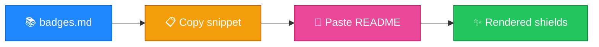

<p align="center">
  
</p>

<h1 align="center">github-profile-badges</h1>

<p align="center">
  <strong>EN</strong> shields.io badge snippets for READMEs & profiles<br/>
  <strong>PT</strong> Snippets de badges shields.io para READMEs e perfis
</p>

<p align="center">
  <a href="https://github.com/manansbdb/github-profile-badges/blob/main/LICENSE"></a>
  
  
  <a href="#support--apoio"></a>
</p>

---

## What it does / Para que serve

| English | Português |
|---------|-----------|
| Curated **shields.io badge snippets** for licenses, stacks, and profile READMEs. | **Snippets de badges shields.io** para licenças, stacks e READMEs de perfil. |
| Copy Markdown from `badges.md` / `examples.md` into any README. | Copia o Markdown de `badges.md` / `examples.md` para qualquer README. |



---

## Install / Instalação

### 1) Clone / Clona

```bash
git clone https://github.com/manansbdb/github-profile-badges.git
cd github-profile-badges
```

### 2) Use snippets / Usa os snippets

```bash
# open and copy Markdown:
# badges.md  → individual badge lines
# examples.md → composed README header examples
# Or copy into your profile repo:
cp badges.md /path/to/USERNAME/USERNAME/docs/badges-reference.md
```

### Requirements / Requisitos

- `git`
- No runtime dependencies (Markdown only)

---

## Quick start / Início rápido

```bash
git clone https://github.com/manansbdb/github-profile-badges.git
cd github-profile-badges
# copy a line from badges.md into your README
```

---

## Contents / Conteúdos

| Path | Purpose / Função |
|------|------------------|
| `badges.md` | Badge snippets |
| `examples.md` | Composed examples |
| `SUPPORT.md` | Donations / Doações |

---

## Project layout / Estrutura

```text
github-profile-badges/
├── docs/banner.svg
├── badges.md
├── examples.md
├── SUPPORT.md
└── README.md
```

---

## Support / Apoio

Bitcoin donations welcome / Doações em Bitcoin bem-vindas:

```
bc1q0qfnlnxyum9u45stzxe0a7jnhtj4j0usfkqdjw
```

See [SUPPORT.md](./SUPPORT.md).

---

## License / Licença

[MIT](./LICENSE) © 2026 manansbdb
